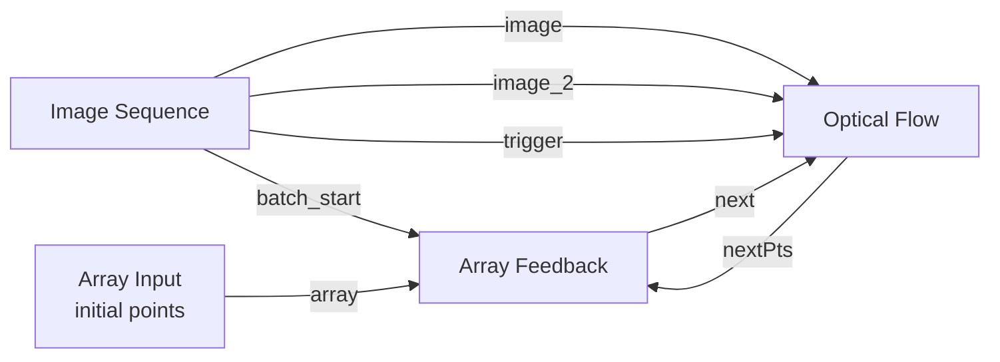

# impronode

## Optical Flow Feedback Example

Use the new Array Feedback node when you need the previous iteration's point array on the next batch step without creating a graph cycle.

Recommended graph for tracking points through an image sequence:

Exact connection order:

1. Connect Array Input.array to Array Feedback.init.
2. Connect Image Sequence.batch_start to Array Feedback.reset.
3. Connect Optical Flow.nextPts to Array Feedback.current.
4. Connect Array Feedback.next to Optical Flow.prevPts.
5. Connect Image Sequence.image to Optical Flow.prevImg.
6. Connect Image Sequence.image_2 to Optical Flow.nextImg.
7. Connect Image Sequence.trigger to Optical Flow.trig.

Notes:

- For Lucas-Kanade tracking across consecutive frames, Array Feedback.next should normally drive Optical Flow.prevPts because those are the points being tracked in the previous image.
- If you also want to provide an LK initial guess, you can additionally connect Array Feedback.next to Optical Flow.nextPts.
- On the first step of each Image Sequence batch run, batch_start resets Array Feedback so its next output comes from init.
- On later steps, Array Feedback.next comes from the previous step's Optical Flow.nextPts output.
